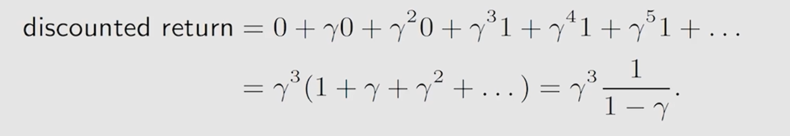

# 如何学习强化学习
- 原理+实践+读论文
- 要花多少时间学习：放弃速成，30个小时
#  1.基本概念 （A gird-world example）
- state:
- state space:所有状态的集合 
- Action: 
- Action space
- state transition:
- Forbidden area:
    case1:可以进去，得到惩罚 
    case2：不可以进去
- policy:在这个状态应该采用哪个action
- 注：在强化学习中Π表示概率
- Reward：正数表示对这个行为鼓励，负数表示对不希望这个行为发生；如果为0，一般来讲是没有惩罚
- Trajectory:链  ruturn是把一条链上的reward全部加起来
- Discounted return:通过控制γ可以控制agent所学的策略，减小γ（注重最近的reward），增大γ（注重长远的reward）
- Episode or trial 
- Markov property:和历史无关的性质
# 2.贝尔曼公式
