# 如何学习强化学习
- 原理+实践+读论文
- 要花多少时间学习：放弃速成，30个小时
#  1.基本概念 （A gird-world example）
- state:
- state space:所有状态的集合 
- Action: 
- Action space
- state transition:
- Forbidden area:
    case1:可以进去，得到惩罚 
    case2：不可以进去
- policy:在这个状态应该采用哪个action
- 注：在强化学习中Π表示概率
- Reward：正数表示对这个行为鼓励，负数表示对不希望这个行为发生；如果为0，一般来讲是没有惩罚
- Trajectory:链  ruturn是把一条链上的reward全部加起来
- Discounted return: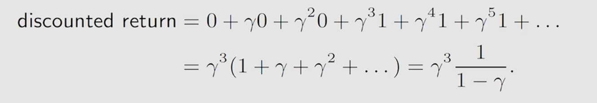通过控制γ可以控制agent所学的策略，减小γ（注重最近的reward），增大γ（注重长远的reward）
- Episode or trial 
- Markov property:和历史无关的性质

  ---

# 2.贝尔曼公式
## 例子说明return的重要性
- Bootstrapping(从自己出发不断迭代得到的一些结果)
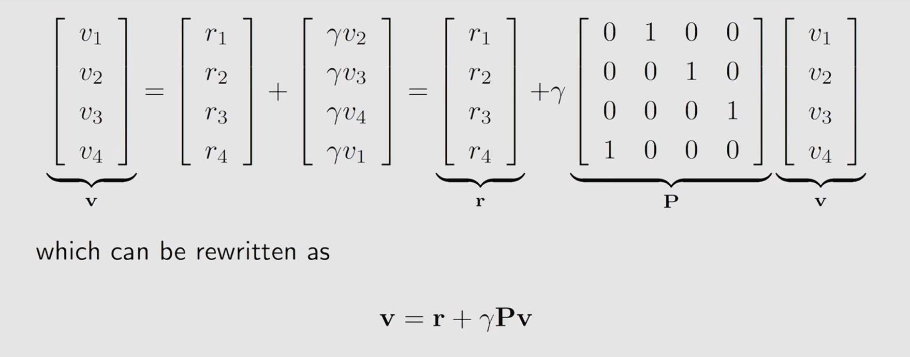
## state value的定义
- 用数学公式表示state value：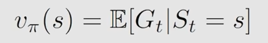
- return和state value的区别：前者是针对单条链求的，state value是针对多条链然后求平均值
## 贝尔曼公式的详细推导
- 用一句话来说这个公式就是它描述了不同状态的state value之间的关系
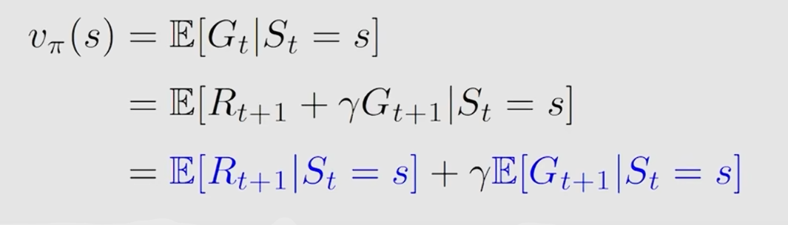 
- 然后我们就有了：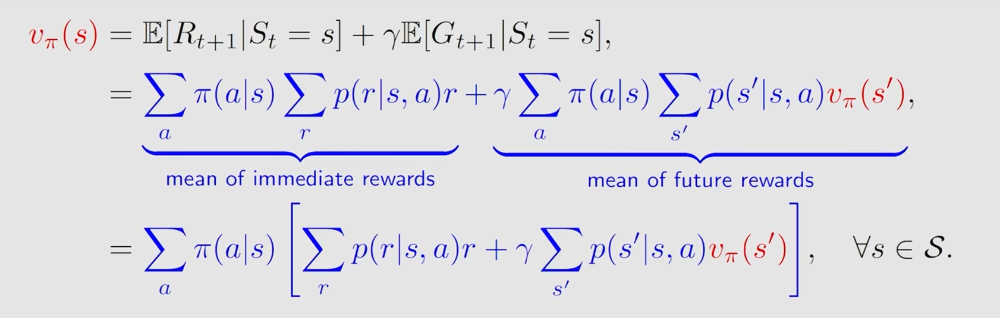
- 看这个例子容易理解这个公式：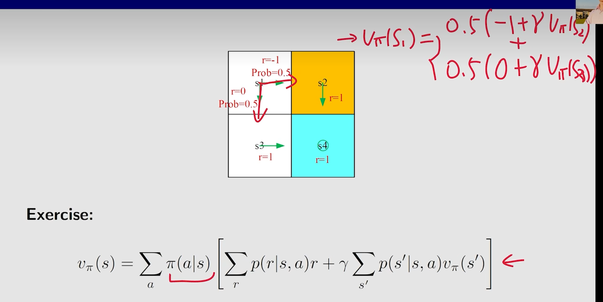
## 公式向量形式与求解
- 将贝尔曼公式化简成这样：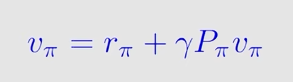
- 其中：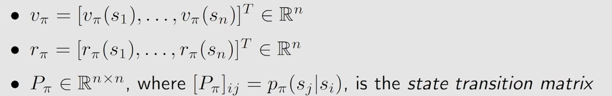最后一项详细为：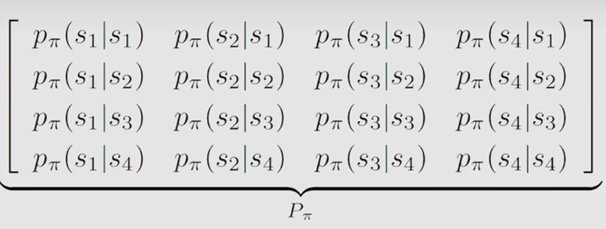
- state value 的解析表达式：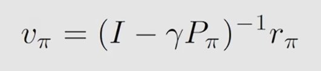
    这样的话，求逆的过程太复杂
- 于是采用迭代的方法：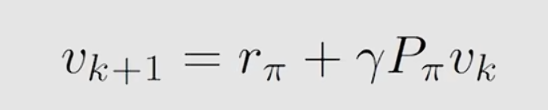
    右边的Vk有一个值，可以求出左边，然后再代入，再求，一直迭代，就会收敛于VΠ
## action value的定义
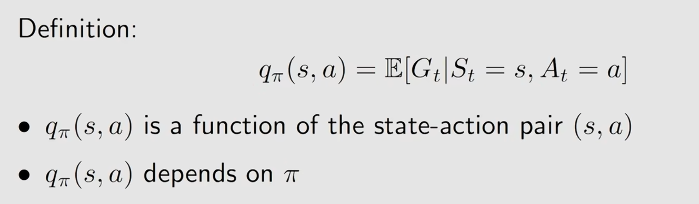
- 下面有两个式子：
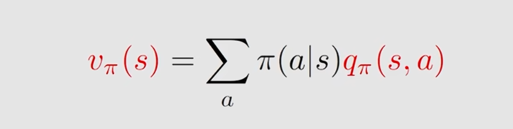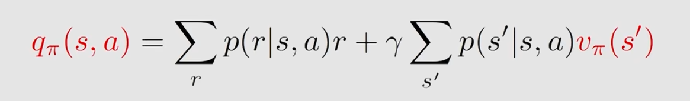
    知道了所有的action value，求平均可以得到state value；知道了state value，可以求出所有的action value

  ---

# 3.贝尔曼最优公式
## 例子-如何改进策略
- 得到了一个比较高的action value，不能确定它下面的几步都是最高的，反而有可能会不好，差不多就是一直迭代，找到一个最优的策略
## 最优策略和公式推导
- 定义：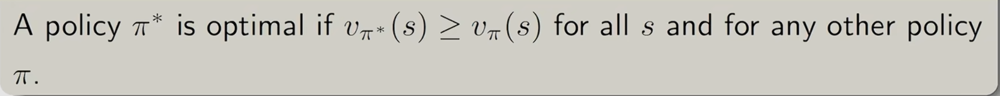
    它比所有的策略都要好，这样的策略是否
- 贝尔曼最优公式：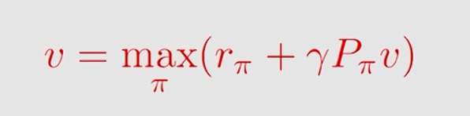
## 公式求解以及最优性
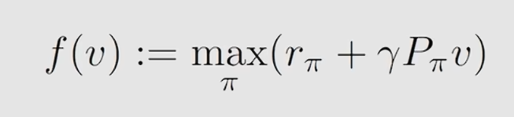
将右边写成一个函数：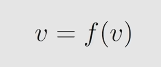
- 不动点:f(x)=x,映射到自己
- 距离比原本的距离要小：||f(x1)-f(x2)||<=γ|x1-x2|
- 假设最优解为：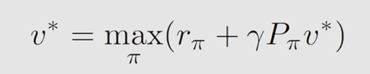
    最优策略为：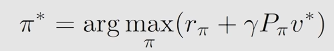
    则：
    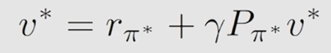
- 所以说贝尔曼最优公式是个特殊的贝尔曼公式
## 最优策略的有趣性质  
- 再次加深γ值的理解：它较小时是比较注重近视（绕路不管总的回报），较大时注重远视（看重长远回报）
- 如果像下图一样修改r,实际上得到的策略没有变化
 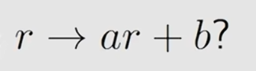
 - 有的时候让走路的时候让r=-1，算是一个能量的消耗，为了不让它绕远路，但是r=0的时候还有γ的约束，所以这时候其实也是不会绕远路的
 - 贝尔曼最优公式的解一定存在且唯一；策略不一定唯一

  ---

# 4.值迭代与策略迭代
这部分内容在学习的时候比较复杂，所有先理解一下概念，再去看数学原理
### 方法一：策略迭代

策略迭代的思想非常直观，就像我们学习一门新技能：**先试试，然后评估，再改进，如此循环。**

它分为两个不断重复的步骤：

#### 步骤一：策略评估

*   **做什么**：固定你当前的策略 π，然后去**计算**在这个策略下，**每一个状态的价值 V(s)**。
*   **怎么算**：通过一种叫做“动态规划”的数学方法反复迭代计算。简单理解就是，一个状态的价值，等于它当前的即时奖励，加上它所有可能到达的“下一个状态”的价值的加权平均。
*   **好比**：你定了一个下棋策略（比如“永远保护王后”）。然后你拿着这个策略去下很多很多盘棋（或者模拟），记录下从每个棋盘局面（状态）开始，你平均能赢多少分（价值）。这个过程就是在**评估**你这个“保护王后”的策略到底好不好。

#### 步骤二：策略改进

*   **做什么**：现在我们已经知道了每个状态在当前策略下的价值 V(s)。那么，我们看看在每个状态，有没有**更好的动作**可以选。
*   **怎么找**：对于每个状态 s，我们检查所有可能的动作 a，看看哪个动作能带来的“即时奖励 + 下一个状态的价值”最高。如果这个最高的值比我们当前策略规定的动作所带来的值还要高，那我们就在这个状态**改用**这个更好的动作。
*   **好比**：在评估中你发现，在某些局面下，主动“弃车”反而比“保护王后”最终能获得更高的分数。那么你就更新你的策略，在这些特定局面下，把动作从“保护王后”改成“弃车”。

**然后，我们用这个更新后的、更好的策略，回到步骤一，重新进行评估... 再改进... 再评估...** 直到策略再也改进不了了（即策略已经稳定），我们就找到了最优策略。

**策略迭代的流程可以总结为：**
`[随机策略] -> 策略评估 -> 策略改进 -> [更好的策略] -> 策略评估 -> 策略改进 -> ... -> [最优策略]`
### 方法二：值迭代

值迭代的思想更“数学”，更直接：**我不关心中间的策略是什么，我直接算出最优策略下的那个终极价值函数就行了。有了终极价值，最优策略自然就出来了。**

它只有一个步骤，但不断重复：

#### 步骤：直接迭代最优价值函数

*   **做什么**：直接去迭代计算**最优价值函数 V\*(s)**。这个 V*(s) 代表的是“从状态 s 开始，一直使用**最优**策略玩下去，能获得的最大总奖励期望”。
*   **怎么算**：同样使用动态规划，但计算方式更“贪心”。在计算每个状态的价值时，它直接取所有可能动作中，能带来最大“即时奖励+下一个状态价值”的那个值。
*   **好比**：你不用先定一个完整的下棋策略。你只专注于计算每一个棋盘局面的“终极潜力分”。你问自己：“在这个局面下，如果我后面走得**完美**，我最多能赢多少分？” 你通过不断更新这个“终极潜力分”来逼近正确答案。

**直到这个“终极潜力分”不再变化，迭代就停止了。**

最后，我们如何从最优价值函数 V*(s) 得到最优策略呢？
非常简单！在每个状态 s，我们只需要选择那个能让我们到达“价值最高”的下一个状态的动作就行了。也就是“看一眼周围，哪条路最金光大道，就走哪条”。

**值迭代的流程可以总结为：**
`[随机价值] -> 值迭代更新 -> [更好的价值] -> 值迭代更新 -> ... -> [最优价值] -> 一步推导出 [最优策略]`

### 生动的比喻：找从家到公司的最优路径

假设你要找一条从家到公司最快（奖励最高）的路线。

*   **策略迭代**：
    1.  **策略评估**：你先随便定一条路线（策略），比如“永远走大路”。然后你每天走这条路，记录下到公司花的时间（价值）。你发现平均要40分钟。
    2.  **策略改进**：你看着地图想，在某个路口，如果我拐进一条小巷（改变动作），会不会更快？你评估了一下，发现确实更快。于是你更新你的策略为“在XX路口拐进小巷”。
    3.  然后你拿着这个新策略“大部分大路，但在XX路口拐小巷”再去实际走几天（策略评估），发现平均时间降到了35分钟。然后再改进... 直到你找不到任何可以缩短时间的改动了。

*   **值迭代**：
    你不需要实际去走。你拿着一张地图和一张表（记录每个路口到公司的时间）。你不断地更新这张表：
    *   “这个路口到公司的时间，等于它到下一个路口的时间，加上下一个路口到公司的最短时间。”
    *   你反复地用这个规则去更新每个路口的时间估计，直到这张表上的时间稳定下来，不再变化。这时，表上记录的就是从每个路口到公司的**最短时间（最优价值）**。
    *   最后，你出门时，在每个路口都选择去往那个“表中时间最短”的下一个路口，走的就是最优路径。

### 核心区别与总结

| 特性 | 策略迭代 | 值迭代 |
| :--- | :--- | :--- |
| **核心思想** | **在“策略评估”和“策略改进”之间切换** | **直接迭代更新最优价值函数** |
| **过程** | 两步走，循环进行 | 一步走，不断重复 |
| **中间产物** | 会产生一系列**不断改进的策略** | 中间只产生**不断改进的价值函数**，没有完整策略 |
| **收敛速度** | 通常**收敛得更快**（策略通常比价值函数收敛得快） | 收敛稍慢 |
| **计算成本** | 每次迭代（策略评估）可能需要很多轮内部计算 | 每次迭代计算量相对较小 |
| **直观性** | 更直观，符合人类学习方式（试错、评估、改进） | 更数学，更直接 |

### 如何选择？

*   当你的**状态空间比较小**，或者你对一个**不错的初始策略**有头绪时，策略迭代通常更快。
*   当你的**状态空间非常大**（比如复杂的游戏），策略迭代中“策略评估”这一步会非常耗时，此时值迭代更常用。

